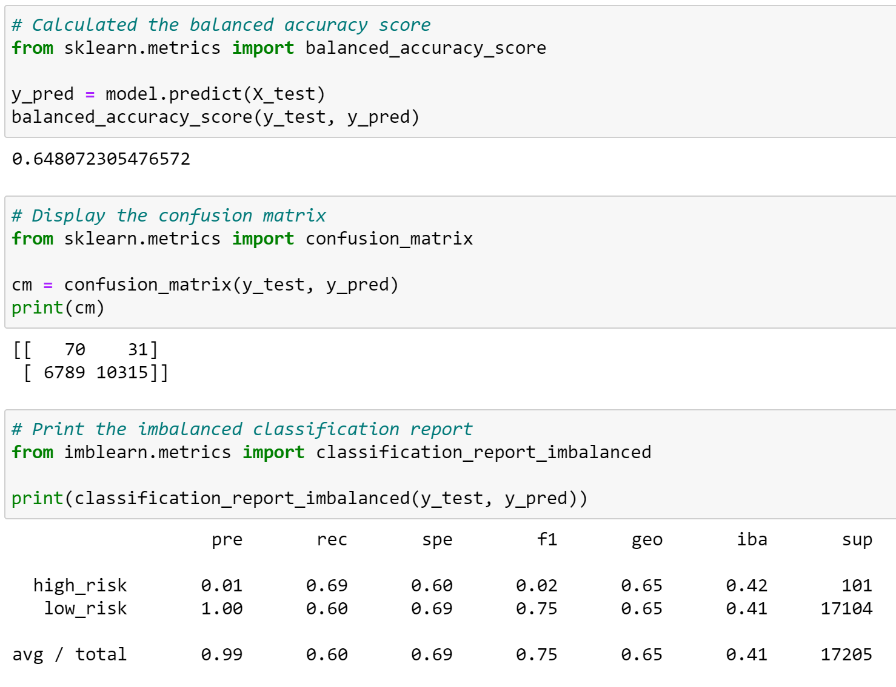
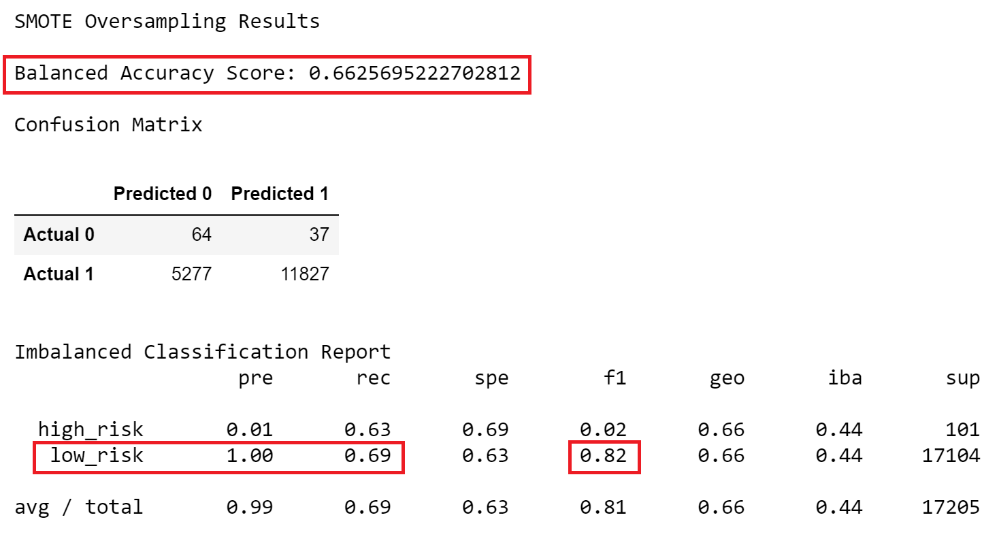
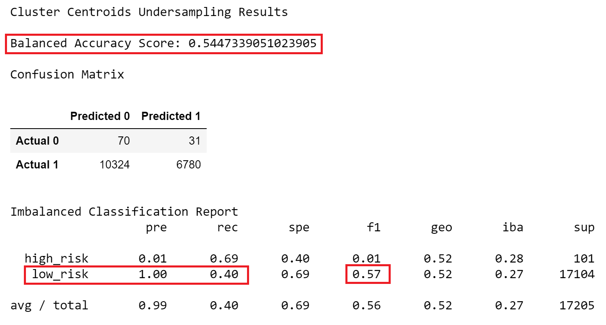
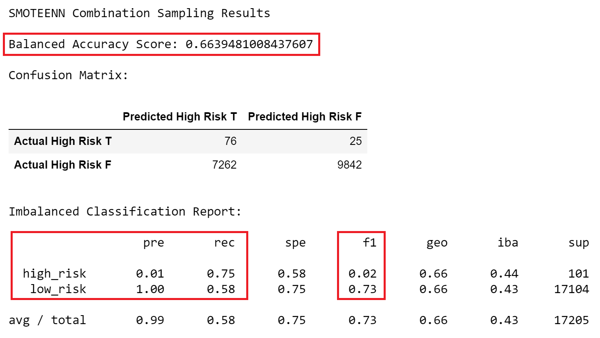
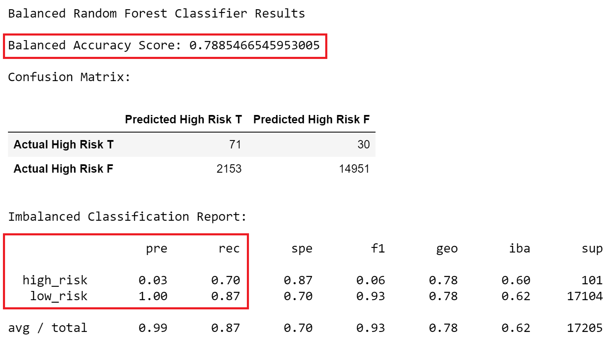
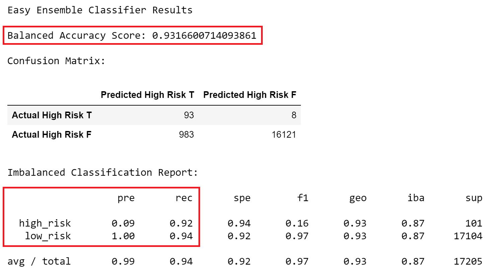

# Credit_Risk_Analysis

  
    
  <a href="#">Resampling Models to Predict Credit Risk</a>

## Table of Contents
* [Overview](https://github.com/rkaysen63/Credit_Risk_Analysis/blob/master/README.md#overview)
* [Resources](https://github.com/rkaysen63/Credit_Risk_Analysis/blob/master/README.md#resources)
* [Results](https://github.com/rkaysen63/Credit_Risk_Analysis/blob/master/README.md#results)
* [Summary](https://github.com/rkaysen63/Credit_Risk_Analysis/blob/master/README.md#summary)

## Resources:    
* Data: 
  *  LoanStats_2019Q1.csv
* Tools: 
  * Python (Libraries: pandas, matplotlib, imblearn, sklearn)
  * Jupyter Notebook
* "Loan Approved" image is courtesy of: http://www.pngall.com/wp-content/uploads/2017/11/Loan-Free-PNG-Image.png
* Lesson Plan: UTA-VIRT-DATA-PT-02-2021-U-B-TTH, Module 17 Challenge

## Overview:
* Overview of the loan prediction risk analysis:  The purpose of this analysis is well defined (4 pt)

## Results:

  <h3>Resampling Models to Predict Credit Risk</h3>

  
  <a href="#">*****************************************************************************************************************************************</a>
     
  
  <a href="#">*****************************************************************************************************************************************</a>
     
  
  <a href="#">*****************************************************************************************************************************************</a>
     
  
  <a href="#">*****************************************************************************************************************************************</a>
     
  
  <a href="#">*****************************************************************************************************************************************</a>
     
  

## Summary:
  * There is a summary of the results (2 pt)
  * There is a recommendation on which model to use, or there is no recommendation with a justification (3 pt)

CONFUSION MATRIX | HIGH RISK PREDICTED TRUE | HIGH RISK PREDICTED FALSE |
-----------------|----------------|-----------------|
HIGH RISK ACTUAL TRUE | TP | FN |
HIGH RISK ACTUAL FALSE | FP | TN |

   
MODEL | BALANCED ACCURACY | PRECISION | RECALL |
--------------------|--------------------|--------------------|--------------------|
Formula | (TP + TN)/)TP + FP + TN + FN) | TP/(TP + FP) | TP/(TP = FN) | 
RandomOverSampler | 0.65 | 0.01 | 0.69 | 
SMOTE | 0.66 | 0.01 | 0.63 | 
ClusterCentroids | 0.54 | 0.01 | 0.69 |
SMOTEENN | 0.66 | 0.01 | 0.75 |  
BalancedRandomForestClassifier | 0.79 | 0.03 | 0.70   |
EasyEnsembleClassifier |0.93 | 0.09 | 0.92|

   

[Back to the Table of Contents](https://github.com/rkaysen63/Credit_Risk_Analysis/blob/master/README.md#table-of-contents)
