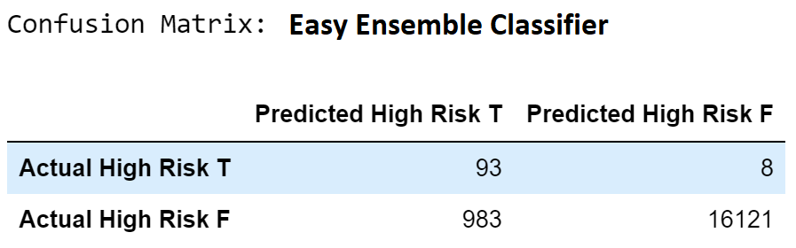

# Credit_Risk_Analysis

  
    
  <a href="#">Resampling Models to Predict Credit Risk</a>

## Table of Contents
* [Overview](https://github.com/rkaysen63/Credit_Risk_Analysis/blob/master/README.md#overview)
* [Resources](https://github.com/rkaysen63/Credit_Risk_Analysis/blob/master/README.md#resources)
* [Results](https://github.com/rkaysen63/Credit_Risk_Analysis/blob/master/README.md#results)
* [Summary](https://github.com/rkaysen63/Credit_Risk_Analysis/blob/master/README.md#summary)
## Resources:    
* Data: 
  *  LendingClub data:  LoanStats_2019Q1.csv
* Tools: 
  * Python (Libraries: pandas, matplotlib, imblearn, sklearn)
  * Jupyter Notebook
* "Loan Approved" image is courtesy of: http://www.pngall.com/wp-content/uploads/2017/11/Loan-Free-PNG-Image.png
* Lesson Plan: UTA-VIRT-DATA-PT-02-2021-U-B-TTH, Module 17 Challenge

## Overview:
The purpose of this analysis is evaluate six supervised machine learning models for their ability to predict high risk of loan default.  The models will be trained using an unbalanced dataset from LendingClub lending services. (The ratio of low risk loans to high risk loans in the dataset used for this analysis is nearly 200:1.)

## Results:

  <h3>Resampling Models to Predict Credit Risk</h3>

  
  <a href="#">*****************************************************************************************************************************************</a>
     
  
  <a href="#">*****************************************************************************************************************************************</a>
     
  
  <a href="#">*****************************************************************************************************************************************</a>
     
  
  <a href="#">*****************************************************************************************************************************************</a>
     
  
  <a href="#">*****************************************************************************************************************************************</a>
     
  

## Summary:
The imbalanced data used to train the models:
* low-risk:  
  * total population:  68,470
  * test population:  17,104
* high-risk: 
  * total population: 347
  * test population:  101

The confusion matrix below explains how to interpret the six confusion matrices shown in the results above.
 * TP is the number of customers that the model correctly predicts to default.  
 * FP is the number of customers that the model predicts will default but they did not.
 * FN is the number of customers that default but the model predicts that they do not default.
 * TN is the number of customers that do not default and the model correctly predicts that they do not default.

CONFUSION MATRIX | HIGH RISK PREDICTED TRUE | HIGH RISK PREDICTED FALSE |
-----------------|----------------|-----------------|
HIGH RISK ACTUAL TRUE | TP | FN |
HIGH RISK ACTUAL FALSE | FP | TN |

* Accuracy is the ratio of true predictions to total number of predictions.  As accuracy approaches 1.00, false negatives and false negatives approach 0.
`Accuracy = (TP+TN)/(TP + TN + FP + FN) = (101 + 17104)/(101 + 17104 + 0 + 0) = 1.00`  
* Precision   
Precision is a ratio of true positive predictions to total positive predictions.   As precision approaches 1.00, false positives diminish.    
`Precision = TP/(TP + FP) = 101/(101 + 0) = 1.00`   
* Recall (AKA Sensitivity)   
`Sensitivity = TP/(TP + FN) = 101(101 + 0) = 1.00`   
Sensitivity is a ratio true positive predictions to total actual values.  As sensitivity approaches 1.00, false negatives diminish.   

### Comparison of Results - High Risk of Default 

MODEL | BALANCED ACCURACY | HIGH RISK PRECISION | HIGH RISK RECALL |
--------------------|--------------------|--------------------|--------------------|
Formula | (TP + TN)/(TP + FP + TN + FN) | TP/(TP + FP) | TP/(TP + FN) | 
RandomOverSampler | 0.65 | 0.01 | 0.69 | 
SMOTE | 0.66 | 0.01 | 0.63 | 
ClusterCentroids | 0.54 | 0.01 | 0.69 |
SMOTEENN | 0.66 | 0.01 | 0.75 |  
BalancedRandomForestClassifier | 0.79 | 0.03 | 0.70   |
EasyEnsembleClassifier |0.93 | 0.09 | 0.92|

    
   

* Low Risk of Default on Loans   
We're not really concerned with how well the models predict low risk loan applications, but according to precision and recall scores all models perform well to this end.

* High Risk of Default on Loans:   
The summary chart above displays the results for high risk loan applications for easy comparison.  When considering whether to approve or not to approve a loan application based on risk, sensitivity is more important than precision.  It's more conservative to reject low risk loan applications than miss rejecting high risk loan applications.
  All of the models above have poor precision results.  In other words, these models are conservative by rejecting a number of low risk loans.

  Although both of the Ensemble classifiers outperform the previous four machine learning models in terms of accuracy, precision and sensitivity, the EasyEnsembleClassifier is the superior to the other five for predicting high risk of default.

  

    
  

  * Accuracy - EasyEnsembleClassifier has a 93% accuracy.  It outperforms the nearest model, BalancedRandomForestClassifier, by 14%.
  * Precision - Athough the precision is very low, Precision = 0.09, indicating a large number of false positives, EasyEnsembleClassifier has the least amount of false positives compared to the other models, indicating that fewer low risk loans will be rejected.  It's conservative and as stated above, it's better to reject some low risk loans than approve a number of high risk loans. Note that part of the reason the precision is so low is because the data is imbalanced. In reality only 6% (983/17104 * 100) of the low risk loans would be rejected, but that number, FP = 983, is over 10 times TP = 93, thereby aggressively lowering the precision value.  
  * Sensitivity - When considering risk of default it is important to have as few false negative results as possible.  In other words, the higher the sensitivity the less likely a high risk loan will be categorized as low risk. The EasyEnsembleClassier model had the highest sensitivity value of all the models and a very high sensitivity value of 92%.  In fact only 8% of the customers with a high risk of default were categorized incorrectly.  The question is, what is considered an acceptable percentage of high risk loans to be approved?  If the answer is less than 8% then EasyEnsembleClassifier fails, although it performs well per its metrics.

[Back to the Table of Contents](https://github.com/rkaysen63/Credit_Risk_Analysis/blob/master/README.md#table-of-contents)
