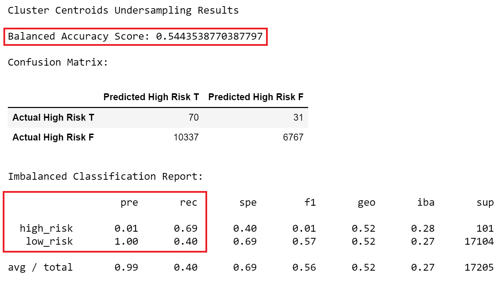

# Credit_Risk_Analysis

  
    
  <a href="#">Resampling Models to Predict Credit Risk</a>

## Table of Contents
* [Overview](https://github.com/rkaysen63/Credit_Risk_Analysis/blob/master/README.md#overview)
* [Resources](https://github.com/rkaysen63/Credit_Risk_Analysis/blob/master/README.md#resources)
* [Results](https://github.com/rkaysen63/Credit_Risk_Analysis/blob/master/README.md#results)
* [Summary](https://github.com/rkaysen63/Credit_Risk_Analysis/blob/master/README.md#summary)

## Resources:    
* Data: 
  *  LoanStats_2019Q1.csv
* Tools: 
  * Python (Libraries: pandas, matplotlib, imblearn, sklearn)
  * Jupyter Notebook
* "Loan Approved" image is courtesy of: http://www.pngall.com/wp-content/uploads/2017/11/Loan-Free-PNG-Image.png
* Lesson Plan: UTA-VIRT-DATA-PT-02-2021-U-B-TTH, Module 17 Challenge

## Overview:
* Overview of the loan prediction risk analysis:  The purpose of this analysis is well defined (4 pt)

## Results:
### Resampling Models to Predict Credit Risk
   
MODEL | BALANCED
   

  
  <a href="#">*****************************************************************************************************************************************</a>
     
  
  <a href="#">*****************************************************************************************************************************************</a>
     
  
  <a href="#">*****************************************************************************************************************************************</a>
     
  
  <a href="#">*****************************************************************************************************************************************</a>
     
  
  <a href="#">*****************************************************************************************************************************************</a>
     
  

### Deliverable 3: Use Ensemble Classifiers to Predict Credit Risk.  Complete all requirements below:

* The BalancedRandomForestClassifier algorithm does the following:
  * An accuracy score for the model is calculated (2.5 pt)
  * A confusion matrix has been generated (2.5 pt)
  * An imbalanced classification report has been generated (5 pt)
  * The features are sorted in descending order by feature importance (5 pt)
* The EasyEnsembleClassifier algorithm does the following:
  * An accuracy score of the model is calculated (2.5 pt)
  * A confusion matrix has been generated (2.5 pt)
  * An imbalanced classification report has been generated (5 pt)
* Results: There is a bulleted list that describes the balanced accuracy score and the precision and recall scores of all six machine learning models (15 pt)

## Summary:
 
  * There is a summary of the results (2 pt)
  * There is a recommendation on which model to use, or there is no recommendation with a justification (3 pt)

[Back to the Table of Contents](https://github.com/rkaysen63/Credit_Risk_Analysis/blob/master/README.md#table-of-contents)
